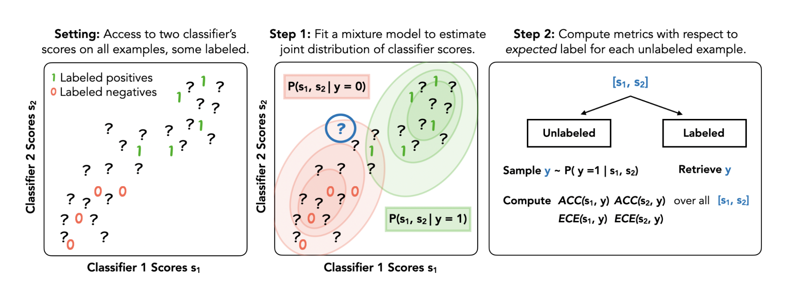

#  Semi-Supervised Model Evaluation (SSME)

---

This repository contains the code for "Evaluating Multiple Models using Labeled and Unlabeled Data" (NeurIPS 2025). The repository implements working examples of Semi-Supervised model Evaluation (SSME), a new framework designed to estimate evaluation metrics (e.g., accuracy or calibration error) for classifiers in settings with limited labeled data.
SSME takes advantage of unlabeled data, multiple models, and continuous probabilistic predictions to deliver performance estimates that are far more accurate 
than standard approaches to classifier evaluation. For additional details and results, do check out the associated [paper](https://arxiv.org/abs/2501.11866).

## Reproducing results: CivilComments

We provide code to reproduce results on CivilComments, along with pre-computed model predictions in the `inputs` folder. To replicate a comparison of SSME to labeled data alone and ground truth performance estimates: 

1. Clone this repository 
2. Install requirements 
3. Run `demo_notebook.ipynb` 

## Applying SSME to your own task 

SSME accepts three inputs: labeled data, unlabeled data, and a set of classifiers. You can apply SSME in your setting by following these steps.

1. Apply each classifier in your set of classifiers to all examples, creating an array of model predictions of shape (n_examples, n_classes). 
2. Save each model's predictions to a distinct folder under `inputs`.
3. Modify `DATASET_INFO` , in `utils.py`, to include a new entry for the desired task.
4. Run `python run_ssme.py -d <your_dataset> -nl <n_labeled> -nu <n_unlabeled>`.
5. Read results from the `outputs` folder.

SSME supports subgroup-specific performance estimation (see the demo_notebook.ipynb for an example), as well as semi-supervised evaluation of multi-class predictions. 

## Contact

For questions, bug reports, or collaborations, please reach out to Divya Shanmugam at [divyas@cornell.edu](mailto:divyas@cornell.edu) and Shuvom Sadhuka at [ssadhuka@mit.edu](mailto:ssadhuka@mit.edu). We pronounce SSME as "Sesame", but you're welcome to your favorite pronunciation :) 
